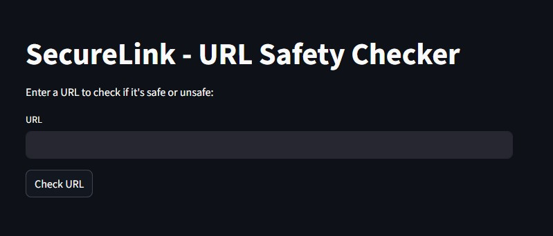
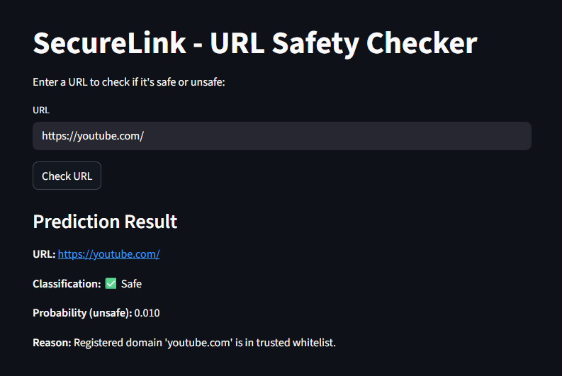
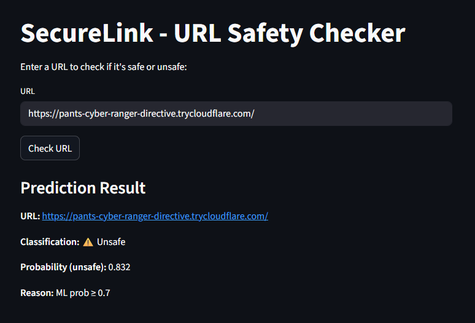

# 🔒 SecureLink: Cloud Platform for Phishing URL Identification

> *A smart, ML-based web application that detects phishing and unsafe URLs in real time. 
 Visit here: https://securelink-bl3ytge2glnkymlannrsva.streamlit.app/ *

---

## Overview

**SecureLink** is an **AI-driven web application** that instantly analyzes URLs for phishing and safety threats.  
Powered by a **Machine Learning (Random Forest Classifier)** model, SecureLink classifies URLs as *Safe* or *Unsafe* based on advanced lexical and statistical feature extraction.

The project is built for **online security**, **phishing prevention**, and **user awareness**, with an intuitive UI for all users.

---

## Working Principle

1. User enters a **URL** through the Streamlit frontend.
2. The **Flask backend**:
   - Extracts lexical features (domain length, “@” count, dots, etc.)
   - Applies **TF-IDF Vectorization** to text parts.
   - Uses a pre-trained **Random Forest** model for prediction.
3. The API returns:
   - ✅ *SAFE* if the URL is legitimate.
   - ⚠️ *UNSAFE* if the URL resembles phishing/unsafe characteristics.
4. UI displays prediction with confidence score and clear indicators.

---

## ⚙️ Tech Stack

| Layer        | Technology                        | Description                                     |
|--------------|-----------------------------------|-------------------------------------------------|
| **Frontend** | Streamlit                         | Modern UI for submitting and viewing results    |
| **Backend**  | Flask                             | REST API, feature extraction, inference engine  |
| **ML Model** | Scikit-learn (RandomForest)       | Trained classifier on phishing dataset          |
| **Data**     | Pandas, NumPy                     | Data manipulation and preprocessing             |
| **Storage**  | Joblib                            | Model and vectorizer serialization              |
| **Viz**      | Streamlit, Matplotlib             | Results presentation and basic visualization    |

---

## Setup Instructions

**Clone the Repository**
git clone https://github.com/SaiHariKrishna/SecureLink.git

cd SecureLink

**Install Dependencies**

pip install -r requirements.txt

python train_model.py

**Run Flask Backend**

python app.py

**Start Streamlit Frontend**

streamlit run frontend.py

---

## Example Usage

- **Safe URL Input:**  
  [https://youtube.com/](https://youtube.com/)  
  ➡️ Output:  
  ✅ SAFE &nbsp;|&nbsp; Confidence: 98.7%

- **Unsafe URL Input:**  
  [https://pants-cyber-ranger-directive.trycloudflare.com/)  
  ➡️ Output:  
  ⚠️UNSAFE &nbsp;|&nbsp; Confidence: 95.2%

---

##  API Endpoints

| Endpoint  | Method | Description                          |
|-----------|--------|--------------------------------------|
| `/predict`| POST   | Takes a URL, responds with prediction|
| `/health` | GET    | Checks API health/status             |

---

## Model Training

- **Algorithm:** RandomForestClassifier  
- **Vectorizer:** TF-IDF (n-gram & lexical features)  
- **Dataset:** 500 URLs (phishing + safe)  
- **Accuracy:** ~96.5%  
- **Artifact:** `phish_rf.joblib` (model + vectorizer)  

---

## Features

- ✅ AI-driven phishing detection
- ✅ Real-time URL classification
- ✅ Clean Streamlit user interface
- ✅ Flask API supports integration
- ✅ Explainable results & confidence score
- ✅ Extendable (browser extension, integrations)

---

## Screenshots
 
  

---

## Author
**Konda Venkata Sai Harikrishna**  
  B.Tech CSE (2023–2027), Woxsen University  

---

